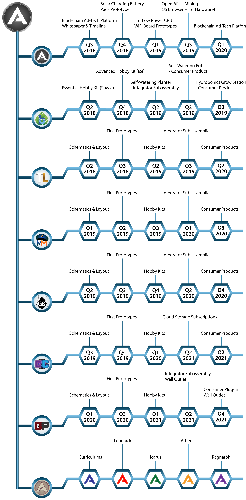

# Adosia Token (ADO) Initiatives

This repository contains source, design concepts, usage implementations and future initiatives pertinent to the Adosia Token (ADO).  All Adosia sub-initiatives will have links to corresponding repositories as they become available.

Further note that this repository attempts to convey Adosia's current design, plans and thinking,
and will inevitably change during Adosia's implementation of the various ADO integrations.

# ADO Token - current usages:

- Purchase Adosia IoT Hardware

- Purchase IoT Subscriptions

- Compensate Participating Adosia Publishers

# Future use cases for the ADO Token:

- Mining Payouts to Adosia IoT Hardware Owners

- Purchase Ad Inventory on Adosia Publishers

- Alternative Publisher Revenue

# Adosia Roadmap

Consult the roadmap section the Adosia [homepage](https://adosia.com/) for a visual description of the product phases of ADO integration.

