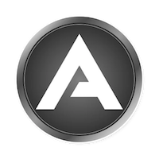

# Adosia Token (ADO)

This repository contains source, design concepts, usage implementations and future initiatives pertinent to the Adosia Token (ADO). Development efforts will entail building a Plutus smart contract (to be deployed on the Cardano blockchain protocol) that will interface with the [Adosia IoT Platform](https://adosia.com).

The goal of the ADO smart contract is to elevate communities by enabling an entirely new class of powerful peer-to-peer economic opportunities.

The ADO smart contract will enable existing Adosia IoT Platform users the ability to monetize (sell/license)
their perfected IoT device operating profile creations to other Adosia users within a peer-to-peer marketplace.
Adosia IoT Platform users will use ADO tokens to sell or purchase IoT device operating profiles within the Adosia IoT Platform.

The Adosia IoT Platform is functional and permits Adosia users to rapidly create and deploy custom IoT WiFi control systems.
Providing Adosia users the ability to monetize their IoT creations will incentivize them to create/perfect new IoT device profile offerings
while rewarding them (via sales) for promoting their creations to the world.

# Aligning with Cardano

[IOHK](https://iohk.io/about/) is a technology company working to provide financial services to the three billion unbanked people in the world that don't have them.
IOHK's [Cardano](https://www.cardano.org) project is a fully open source public blockchain and cryptocurrency initiative seeking to deliver a smart contract platform
having more advanced features that any protocol developed to date.  Adosia has selected Cardano as the target blockchain and smart contract platform for the ADO token as the Cardano project is the first
blockchain initiative to evolve utilizing robust scientific procedures including scientific research, academic peer review, and formal methods.

The Adosia IoT Platform will be expanded in parallel with the development of Cardano and the ADO smart contract will be launched once Cardano smart contracts become available.

# ADO Token Allocations for Early Adosia IoT Platform Adopters

Prior to the future release of the ADO smart contract, a random amount of ADO tokens will be tentatively allocated to a respective
Adosia IoT Platform user's account whenever that user first connects (and activates) any Adosia-supported open hardware IoT device to the Adosia IoT Platform.

Once the Adosia platform confirms newly connected IoT hardware to be a legitimate IoT device (ruling out bot connections, platform manipulation, etc.),
the respective tentative token allocation will be secured to the connecting user's account with the Adosia IoT Platform. All token allocations secured prior to the production release
of the ADO smart contract (following Cardano smart contract availability) will become transferable to the respective user's Cardano wallet address upon the release of the ADO smart contract.

The Adosia IoT Platform supports ESP8266-based WiFi baseboards which currently include the WEMOS D1 R2 and WEMOS D1 Mini WiFi baseboards,
and does not require users to purchase hardware from (or manufactured by) Adosia.  This enables anyone in the world the ability to begin using and creating with the Adosia IoT Platform for free.

# How to Connect IoT Hardware to the Adosia IoT Platform

1. Sign Up FREE for the [Adosia IoT Platform](https://adosia.com)

2. Obtain compatible IoT hardware pre-flashed with the latest Adosia binary by either:

  - purchasing a WEMOS WiFi baseboard pre-flashed with the Adosia binary (along with optional [Adosia SPACE IO board](https://adosia.io/product/adosia-iot-space-io-board-shield/)) from the [Adosia IoT Store](https://adosia.io)
 
  - or you can use the popular Arduino IDE to download by latest Adosia binary by flashing your own WEMOS WiFi baseboard with Adosia's open source [phoenix connect script](https://github.com/adosia/adosia-iot/tree/master/SPACE_v2.2/adosia_phoenix)

3. Use a mobile device to connect your IoT hardware to the Adosia IoT Platform (see [Adosia Learn Page](https://adosia.com/faq))
  

Compatible open hardware boards flashed using Adosia's open source [phoenix connect script](https://github.com/adosia/adosia-iot/tree/master/SPACE_v2.2/adosia_phoenix) and the Arduino IDE will automatically connect to Adosia servers to download the latest Adosia binary.

The schematics and layout files for Adosia's open hardware SPACE v2.2 IO board (compatible with WEMOS D1 R2 WiFi baseboard) can be found [here](https://github.com/adosia/adosia-iot/tree/master/SPACE_v2.2/hardware/IO_BOARD_WEMOS_D1R2)

Adosia will publish manufacturing schematic and layout files for an IO board compatible with the WEMOS D1 Mini baseboard in the near future.