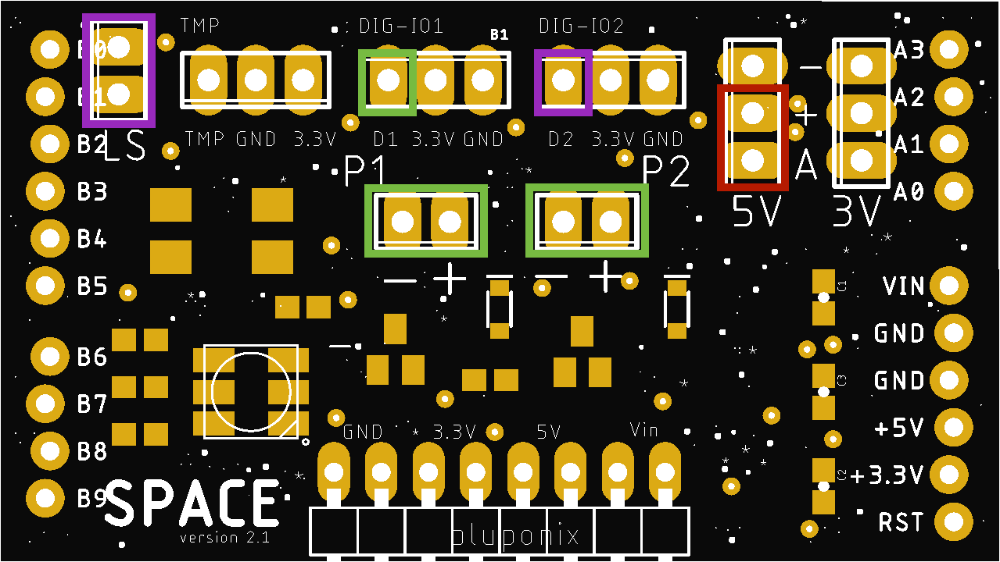
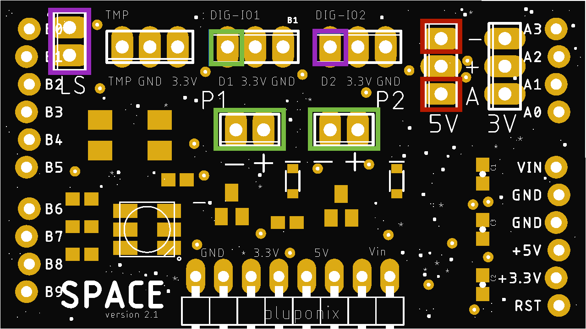
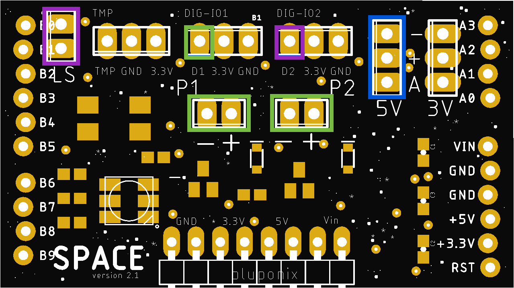
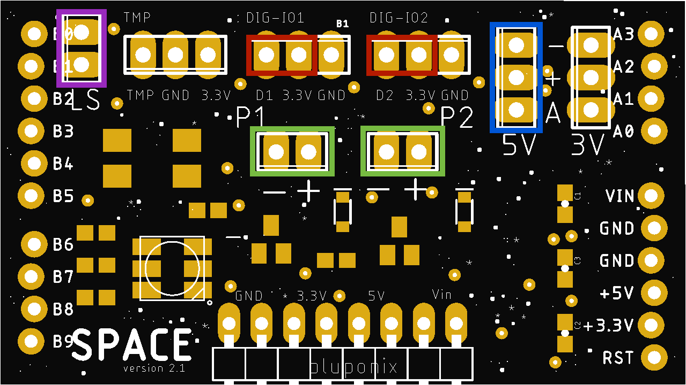

# BluPonix Space v2.1 (no wifi)

Bluponix Space v2.1 is part of an open hardware IO platform initiative to enable anyone to easily create a variety of useful personal plant watering and cultivation systems. 
The Space v2.1 IO board is designed to be pin compatible with the popular open hardware Arduino Uno R3 microcomputer controller boards, commonly used for prototyping and hobby builds.

# Supported Hardware:

- 12V 5W Submersible DC water pump (x2)

- water level sensor switch (x1)

- digital IO / external relay (x2)

- analog input / soil moisture sensor (x1)

- RGB LED (x1)

- supply voltage headers - x2 each: Vin / 3.3V / 5V / GND

# Operating Modes (set using jumpers):

- Personal Hydroponics Modes

- Personal Garden - mini-pumps + external relay* both trigger when soil moisture low

- Self-Watering Pot - Soil-Moisture Sensing

*external relay could be any arbitrary digital IO output

# Personal Hydroponics Mode A:

- x2 mini-pumps + external digital IO #1 trigger on cycle

- water cycle is set to 30 seconds on / 90 seconds off

- digital IO #2 triggers HIGH when water level low is detected (useful for relay water reservoir refill)

- to enable Personal Hydroponics A, place a jumper connecting the analog input with the 5V power supply

*jumper connector placement shown in red
________________________________________________________________________________________________________________________________

# Personal Hydroponics Mode B:

- x2 mini-pumps + external digital IO #1 trigger on cycle

- water cycle is set to 90 seconds on / 270 seconds off

- digital IO #2 triggers HIGH when water level low is detected (useful for relay water reservoir refill)

- to enable Personal Hydroponics B, short a jumper wire connecting the analog input with the GND pin

*jumper wire short connection shown in red
________________________________________________________________________________________________________________________________

# Personal Garden Mode:

- x2 mini-pumps + external digital IO #1 trigger on sensing soil moisture low

- digital IO #2 triggers HIGH when water level low is detected (useful for relay water reservoir refill)

- to enable Personal Garden Mode, connect the moisture sensor and remove all jumpers

*moisture sensor connection shown in blue
________________________________________________________________________________________________________________________________

# Self-Watering Pot / Planter Mode:

- x2 mini-pumps trigger on sensing soil moisture low

- to enable Self-Watering Pot mode, connect the moisture sensor and place jumpers on both digital IO input pins as shown below

*jumper wire connector placements shown in red - moisture sensor connection shown in blue
________________________________________________________________________________________________________________________________
