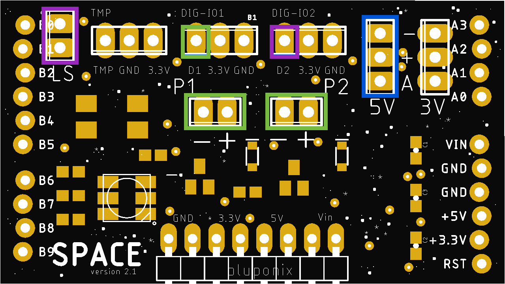

# BluPonix Space v2.1 (no wifi)

Bluponix Space v2.1 is part of an open hardware IO platform initiative to enable anyone to easily create a variety of useful personal plant watering and garden cultivation systems.

The Space v2.1 IO board is designed to be pin compatible with the popular open hardware Arduino Uno R3 microcomputer controller boards, commonly used for prototyping and hobby builds.

Default open-source software for Space v2.1 operating with an Arduino uno host microcontroller can be found [here](https://github.org)

# Space v2.1 Supported Hardware:

- Submersible 12V DC Water Pumps -OR- Solenoids - 5W mix-and-match (x2)

- Water level sensor switch (x1)

- Digital IO / external relay control (x2)

- Analog input / soil moisture sensor (x1)

- RGB LED (x1)

- Supply voltage headers - x2 each: Vin / 3.3V / 5V / GND

- Temp Sensor Support w/ data line tied to Vcc through a 4.7k pullup resistor

Navigate the subdirectories to find various software packages that can be used with this board (more coming soon)