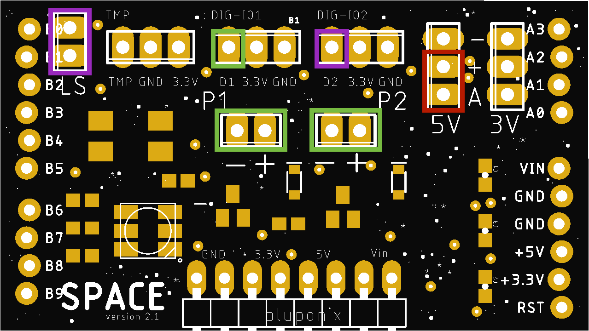
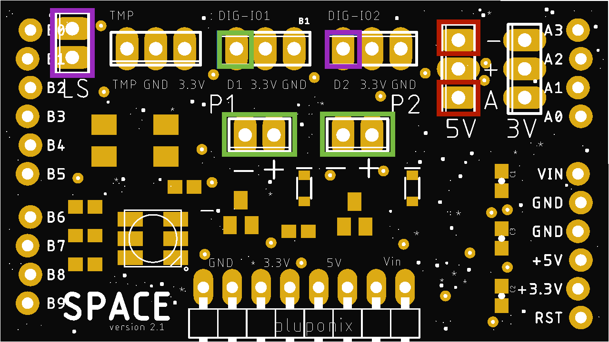

# Default Software for BluPonix Space v2.1 (no wifi)

This is the repository for the default software that ships with any Bluponix Space v2.1 IO board + Arduino Uno hardware combination or hobby kit.

Technical details and more information specific the Space v2.1 IO hardware platform can be found [here](https://www.github.com)

# x4 Operating Modes (modes set using jumpers):

- Mode 1:  Hydroponics Parallel Watering

- Mode 2:  Hydroponics Alternate Watering

- Mode 3:  Soil Grow - Personal Garden

- Mode 4: Soil Grow - Self-Watering Pot / Small Grow:

# Jumper Settings for Default Software:

- To Disable use of the water

- Mode 2:  Hydroponics Alternate Watering

- Mode 3:  Soil Grow - Personal Garden

- Mode 4: Soil Grow - Self-Watering Pot / Small Grow:

# Mode 1:  Hydroponics Parallel Watering:

- x2 water pumps (or solenoids) trigger in parallel on water cycle

- each pump water cycle is set to water 90 seconds on / 270 seconds off

- digital IO 1 triggers external relay 1 for the duration of both pump cycles

- digital IO 2 triggers external relay 2 when water level low is detected, in 90s increments, until water low is no longer detected

- to enable Mode 1, place a jumper connecting the analog input of the soil moisture sensor directly with the adjacent 5V power pin

jumper connector placement shown in red
________________________________________________________________________________________________________________________________

# Mode 2:  Hydroponics Alternate Watering:

- x2 water pumps (or solenoids) alternate watering cycles

- each pump water cycle is set to water 90 seconds on / 270 seconds off

- digital IO 1 triggers external relay 1 for the duration of both pump cycles

- digital IO 2 triggers external relay 2 when water level low is detected, in 90s increments, until water low is no longer detected

- to enable Mode 2, short a jumper wire to connecting the analog input of the soil moisture sensor directly with any GND pin

jumper wire short connection shown in red
________________________________________________________________________________________________________________________________

# Mode 3:  Soil Grow - Personal Garden:

- x2 water pumps (or solenoids) execute sequential watering cycles on soil moisture low

- each water pump is set to water for 90 seconds each before rechecking soil moisture to determine if watering cycle is sufficient

- digital IO 1 triggers external relay 1 for the duration of both pump cycles

- digital IO 2 triggers external relay 2 when water level low is detected, in 90s increments, until water low is no longer detected

- to enable Mode 3:  connect the moisture sensor (represented in blue below) and remove all jumpers

moisture sensor connection shown in blue
________________________________________________________________________________________________________________________________

# Mode 4: Soil Grow - Self-Watering Pot / Small Grow:

- water pump 1 (or solenoid 1) triggers watering cycle in 10 seconds increments on sensing soil moisture low, repeating until moisture level reads good

- water pump 2 (or solenoid 2) triggers when low water level is detected, in 60s increments, until water low is no longer detected

- to enable Mode 4, connect the moisture sensor (blue) and place jumpers (represented in red below) on both digital IO input pins as shown below

jumper wire connector placements shown in red - moisture sensor connection shown in blue
________________________________________________________________________________________________________________________________
